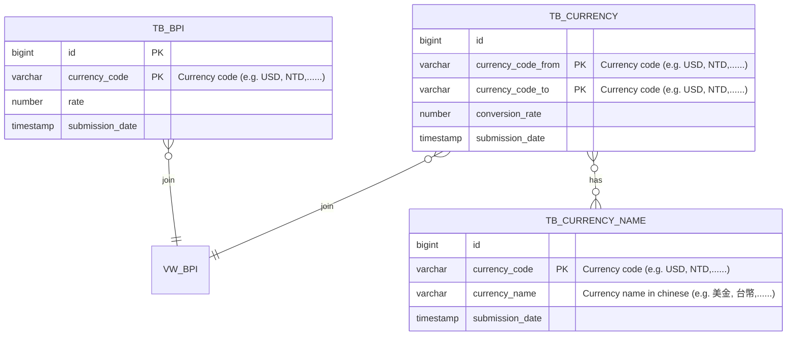

# Coindesk BPI converter

## How to build

1. git clone https://github.com/th-hsu/coindesk.git
2. cd coindesk
3. `./mvnw spring-boot:run`

## How to run tests

1. build
   2 `./mvnw test`

## API Docs

* [SwaggerUI](http://localhost:8080/swagger-ui/index.html)

## Database

* [H2](http://localhost:8080/h2-console/)

## ER Diagram

